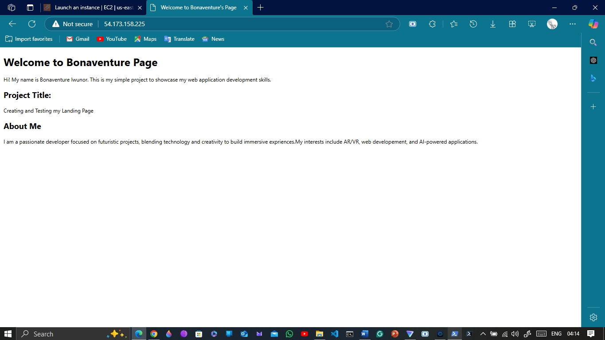

# Bonaventure Iwunor Page Project

## Public IDomain

- https://www.bonaventure.org.ng

## Steps I Took

1. Provision a Linux server on AWS.
2. Install and configure Nginx and Apache but hosted with Apache.
3. Deploy the provided `index.html`.
4. Configure HTTP traffic (port 80).
5. Optional: Set up HTTPS using Let’s Encrypt. Kind of use certbot.
6. I did purchase a domain.

## Screenshot

